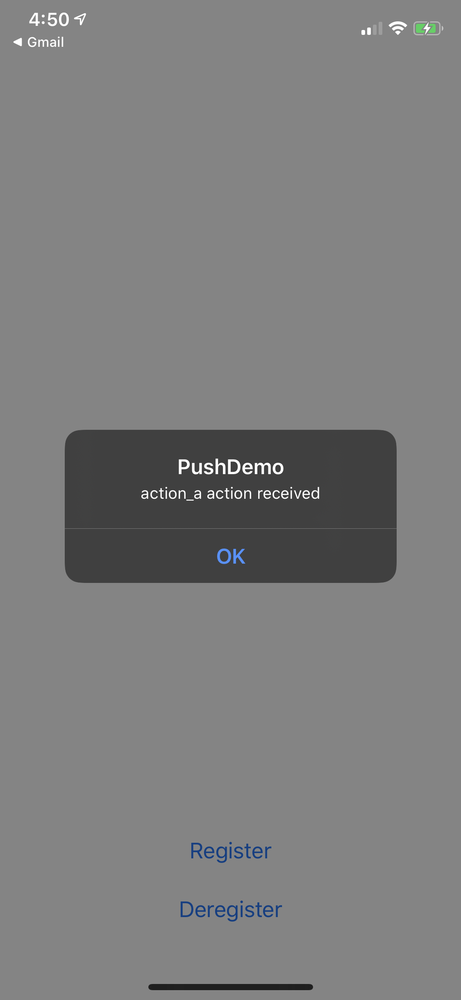
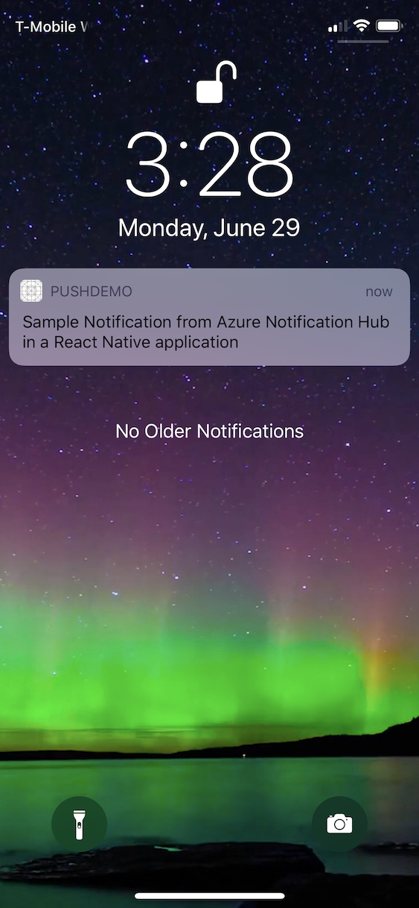

# React Native push notifications via backend service connected to Azure Notification Hub

## Background

Sample demonstrating the use of Azure Notification Hubs via a backend service to send push notifications to Android and iOS applications.

An ASP.NET Core Web API backend is used to handle device registration on behalf of the client using the latest and best Installation approach via the Notification Hubs SDK for backend operations, as shown in the guidance topic Registering from your app backend.

A cross-platform React Native application is used to demonstrate the use of the backend service using explicit register/deregister actions.


If a notification contains an action and is received when app is in the foreground, or where a notification is used to launch the application from notification center, a message is presented identifying the action specified.




Notifications will appear in the notification center when the app is stopped or in the background.




## Create a cross-platform React Native application

In this section, you build a React Native mobile application implementing push notifications in a cross-platform manner.

It enables you to register and deregister from a notification hub via the backend service that you created.

An alert is displayed when an action is specified and the app is in the foreground. Otherwise, notifications appear in notification center.

> [!NOTE]
> You would typically perform the registration (and deregistration) actions during the appropriate point in the application lifecycle (or as part of your first-run experience perhaps) without explicit user register/deregister inputs. However, this example will require explicit user input to allow this functionality to be explored and tested more easily.

### Prerequisites

- Visual Studio Code
- React Native Tools
- For Android, you must have:

  1. Android Studio
  1. A developer unlocked physical device or an emulator (running API 26 and above with Google Play Services installed).

- For iOS, you must have:

  1. Xcode and physical device
  1. An active Apple Developer Account.
  1. A physical iOS device that is registered to your developer account (running iOS 13.0 and above).
  1. A .p12 development certificate installed in your keychain allowing you to run an app on a physical device.

### Create the React Native solution

1. In `Terminal`, update your environment tools, required to work with React Native using the following commands:

```bash
# install node
brew install node
# or update
brew update node
# install wathcman
brew install watchman
# or update
brew upgrade watchman
# install cocoapods
sudo gem install cocoapods
```

1. In `Terminal`, run the following command, if you have `React Native` CLI installed to uninstall it. You are going to use `npx` to automatically use the latest CLI version available:

```bash
npm uninstall -g react-native-cli
```

1. Navigate to your projects folder where you want to create the new application

```bash
# init new project with npx
npx react-native init PushDemo --template react-native-template-typescript
cd PushDemo
npx react-native start
npx react-native run-ios
```

1. Android configure

```bash
# create assets folder for the bundle
mkdir android/app/scr/main/assets
# build the bundle
npx react-native bundle --platform android --dev true --entry-file index.js --bundle-output android/app/src/main/assets/index.android.bundle --assets-dest android/app/src/main/res
# enable ability for sim to access the localhost
adb reverse tcp:8081 tcp:8081
```

Detailed development environment guide is available in the [official documentation](https://reactnative.dev/docs/environment-setup)

### Install required packages

- [🚧 PushNotificationIOS · React Native](https://reactnative.dev/docs/pushnotificationios) - deprecated in favor of the community package: [@react-native-community/push-notification-ios  -  npm](https://www.npmjs.com/package/@react-native-community/push-notification-ios)

- [Apple Push Notifications with React Native and Node.js](https://medium.com/@rossbulat/apple-push-notifications-with-react-native-and-node-js-17cde7b8d065) - guide for iOS and Android - depends on the package above

- Device info package:[react-native-device-info  -  npm](https://www.npmjs.com/package/react-native-device-info)

### Implement the cross-platform components

1. DemoNotificationHandler

```typescript
import PushNotification from 'react-native-push-notification';

class DemoNotificationHandler {
  onNotification(notification: any) {
    console.log('NotificationHandler:', notification);

    if (typeof this._onNotification === 'function') {
      this._onNotification(notification);
    }
  }

  onRegister(token: any) {
    console.log('NotificationHandler:', token);

    if (typeof this._onRegister === 'function') {
      this._onRegister(token);
    }
  }

  attachRegister(handler: any) {
    this._onRegister = handler;
  }

  attachNotification(handler: any) {
    this._onNotification = handler;
  }
}

const handler = new DemoNotificationHandler();

PushNotification.configure({
  onRegister: handler.onRegister.bind(handler),
  onNotification: handler.onNotification.bind(handler),
  permissions: {
    alert: true,
    badge: true,
    sound: true,
  },
  popInitialNotification: true,
  requestPermissions: true,
});

export default handler;

```

1. DemoNotificationService

```typescript
import PushNotification from 'react-native-push-notification';
import DemoNotificationHandler from './DemoNotificationHandler';

export default class DemoNotificationService {
  private lastId: number;

  constructor(onRegister: any, onNotification: any) {
    this.lastId = 0;

    DemoNotificationHandler.attachRegister(onRegister);
    DemoNotificationHandler.attachNotification(onNotification);

    // Clear badge number at start
    PushNotification.getApplicationIconBadgeNumber(function(number: number) {
      if(number > 0) {
        PushNotification.setApplicationIconBadgeNumber(0);
      }
    });
  }

  localNotification(soundName: string) {
    // ...
  }

  scheduleNotification(soundName: string) {
    // ...
  }

  checkPermissions(cbk: any) {
    return PushNotification.checkPermissions(cbk);
  }

  requestPermissions() {
    return PushNotification.requestPermissions();
  }

  cancelNotifications() {
    PushNotification.cancelLocalNotifications({id: '' + this.lastId});
  }

  cancelAll() {
    PushNotification.cancelAllLocalNotifications();
  }

  abandonPermissions() {
    PushNotification.abandonPermissions();
  }
}
```


1. DemoNotificationRegistrationService

```typescript
export default class DemoNotificationService {
    constructor(
        readonly apiUrl: string,
        readonly apiKey: string) {

    }

    async registerAsync(request: any): Promise<Response> {
        const registerApiUrl = `${this.apiUrl}/notifications/installations`;
        const result = await fetch(registerApiUrl, {
            method: 'PUT',
            headers: {
                Accept: 'application/json',
                'Content-Type': 'application/json',
                'apiKey': this.apiKey
            },
            body: JSON.stringify(request)
        });

        this.validateResponse(result);
        return result;
    }

    async deregisterAsync(deviceId: string): Promise<Response> {
        const deregisterApiUrl = `${this.apiUrl}/notifications/installations/${deviceId}`;
        const result = await fetch(deregisterApiUrl, {
            method: 'DELETE',
            headers: {
                Accept: 'application/json',
                'Content-Type': 'application/json',
                'apiKey': this.apiKey
            }
        });

        this.validateResponse(result);
        return result;
    }

    private validateResponse(response: Response) {
        if (!response || response.status != 200) {
            throw `HTTP error ${response.status}: ${response.statusText}`;
        }
    }
}
```

1. AppConfig

- Configuration: [Custom React Native Configurations – a simple solution - Aquent | DEV6](https://www.dev6.com/react/custom-react-native-configurations-a-simple-solution/)

```bash
"configure": "cp .app.config.tsx src/config/AppConfig.tsx"
yarn configure
```

module.exports = {
    ENV: "production",
    API_URL: "https://push-demo-api-alstrakh.azurewebsites.net/api/",
    API_KEY: "123-456",
};

### Implement the cross-platform UI

```Typescript
<View style={styles.container}>
    <Text style={styles.title}>Welcome to PushDemo app</Text>
    <Text style={styles.subtitle}>PushDemo is a React Native application which registers for push notifications with Azure Web API backend and subscribes to receive push updates</Text>
    <Text style={styles.status}>Status: {this.state.status}</Text>
    {this.state.isBusy &&
        <ActivityIndicator></ActivityIndicator>
    }
    <View style={styles.buttonsContainer}>
        <View style={styles.button}>
        <Button title="Register for pushes" onPress={this.onRegisterButtonPress.bind(this)} disabled={this.state.isBusy} />
        </View>
        <View style={styles.button}>
        <Button title="Deregister" onPress={this.onDeregisterButtonPress.bind(this)} disabled={this.state.isBusy} />
        </View>
    </View>
    </View>
```

## Configure the native Android project for push notifications

### Configure required packages

- [Apple Push Notifications with React Native and Node.js](https://medium.com/@rossbulat/apple-push-notifications-with-react-native-and-node-js-17cde7b8d065) - guide for iOS and Android - depends on the package above

### Validate package name and permissions

TBD

### Add the Google Services JSON file

TBD

### Handle push notifications for Android

TBD

## Configure the native iOS project for push notifications

### Configure required packages

- [@react-native-community/push-notification-ios  -  npm](https://www.npmjs.com/package/@react-native-community/push-notification-ios)

### Configure Info.plist and Entitlements.plist

TBD

### Handle push notifications for iOS

TBD
